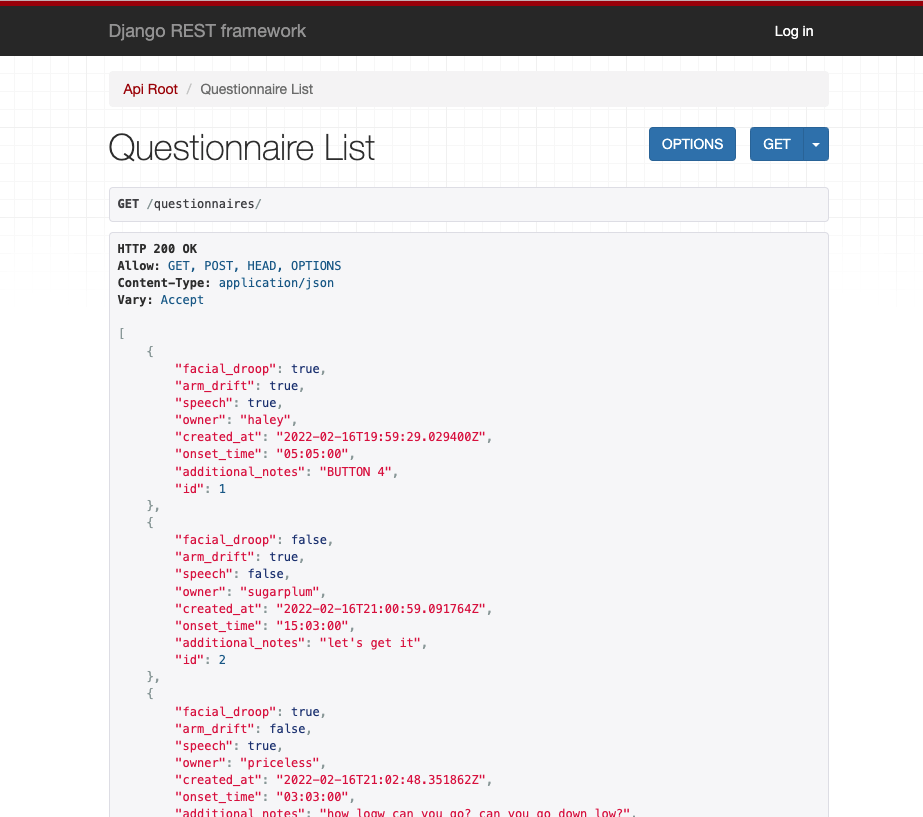

# Stroke Response Django

## Description

The backend of a tool to help identify potential strokes, record valuable information at the time of the neurological event, increase the likelihood of need care sought, and lessen the burden of memory on individuals responding to a possible stroke.

## Technologies Used

- Django
- PostgreSQL

## User Stories

#### MVP

- As a user I want to be able to access a stroke questionnaire, so that I can recognize a stroke in myself or others.
- As a user I want to be able to record answers to the stroke questionnaire, so that I have a detailed record of symptoms to show the doctors in the ER.
- As a user I want to be able to create an account, so that I have the option/ability to view previous event notes in follow-up care visits.
- As a user I want to be able to see my form response notes on a finished screen, so that I can just screenshot the response answers if the account creation feels like a hindrance or unnecessary.
- As a user I want to be able to see an about page that explains strokes and the background of the app, so that I can learn more about strokes, and have reassurance for the validity of the app.
- As a user I want to be able to only see event logs associated with my username if I’m logged in, so that I don't have to dig for my event logs.

#### Stretch

- As a user I want to be able to see the time I started the form, so that I do not have to rely on just myself to record important information.
- As a user I want to be able to Update and Destroy old event logs, so that I have agency over my personal information and can add notes to the log if I remember something important later that I didn’t think to write down.
- As a user I want the ability to edit my account information or delete my account, so that I can still access information if I forget the password or delete my account if necessary.

## Getting Started

### Navigate to the working API

- The working API can be found at [Stropke-Response-API](https://stroke-response-api.herokuapp.com/).
- add 'data/' to the URL path to access the anonymous data.
- add 'data/<relevant id>' to the URL path to access the anonymous data detail by ID.
- add 'questionnaires/' to the URL path to access the user data.
- add 'questionnaires/<relevant id>' to the URL path to access specific user data by ID.
- add 'users/' to the URL path to access the ability to create a user for yourself to post data from.

## Run your own Stroke Response app

> These are the installations and file creations that were done to reach functionality and deployment

- Create files to use during deployment `$ touch .env .gitignore Procfile`.

- Install django `$ pipenv install django`.
- Install for deployment `$ pipenv install psycopg2-binary dj-database-url gunicorn djoser django-cors-headers whitenoise`.

## Hurdles

### Filtering and Security

- Currently the user submitted forms are being filtered by the front-end rather than being automatically filtered by the backend.
- There is currently no way for a user to delete their account.
- Anyone has the ability to delete generic data.

## Future Directions

In the future, I would like users to be able to update their event log to include the outcome. By recording the data we are currently, we have the ability to research correlations in onset time, and symptom frequency. Outcome data would allow for valuable research of the Cincinnati Prehospital Stroke Scale itself.

## Working in Tandem With:

- https://github.com/katlynhutson/stroke_react
- https://stroke-response.netlify.app/
